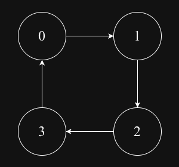

## Cycle detection in Graph

### Graph
#### Undirected cyclic graph

### Detect cycle using DFS in undirected graph
For undirected graph, if u->v it means v->u and logically it can be consider as cycle but technically it is not a cycle as node 'u' is just a parent 'v' and vice-versa. To avoid such scenarios we need to take a help of parent field which represent parent node of ith node.  
And we can ignore skip if child equals to the parent. If child node is already visited it means that we found the cycle else we check all the children node of ith node recursively and if all nodes(vertices) not visited then we can conclude cycle is not exist.

### Detect cycle using BFS in undirected graph
The same logic is there in the BFS, instead passing parent field into each recursive call, we can create a struct as Node which has currentNode value and parent field and here also we skip the node if child equals to parent. If child node is already visited it means that we found the cycle else we push child node into queue and check all the nodes until queue becomes empty.

#### Directed cyclic graph

### Detect cycle using DFS in directed graph
In directed graph, we would have clearly edge between u->v. To mark visited node, we would need an visited slice and we also need inRecursion slice to keep track of whether the node is visited in the recursion call or it visited earlier.

For example: 0 -> 1 <- 2
If we call dfs function on 0 node, then 0 has neighbour node 1 it will go there and mark 1 as visited as true. Also in case of node 2, it will go to node 1 which is already visited based on that it seems like a cycle but NOTE THAT 0->1 and 2->1 ARE TWO DIFFERENT RECURSIVE CALLS so that even though 1 is already visited we cannot consider it as a cycle.

But if we found any node which is already visited inRecursion then it means that we found the cycle.

### Detect cycle using BFS in directed graph
Cycle detection in BFS also known as Kahn's algorithm/Topological sort.
As per the algorithm we starts from a node whose inDegree is 0. If there are such nodes then, we Remove from the queue verify whether the node is already visited or not is yes then we found cycle otherwise we traverse node's children. After traversing each nodes if len of result and the given node are matched it means that we are successfully able to travel all nodes and there is no cycle otherwise graph has a cycle.

