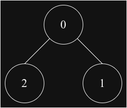
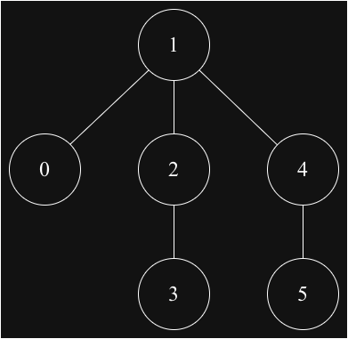

## Diameter in Undirected Graph 

Think of it as the `width` of the graph. It represents the longest it could possibly take to get from point A to point B, assuming you always take the most efficient route.

## Core Concepts:
To understand diameter, we need to understand two precursor terms:
1. Distance (d(u, v)): The length of the shortest path (number of edges) between node u and node v.
2. Eccentricity (ε(v)): The greatest distance between a specific node v and any other node in the graph. It measures how "far" a node is from the furthest reaches of the graph.

## Algorithm
1. Find out the how farthest node from any random node(let's say 0)
2. Find out the farthest node from the step-1 to get the two farthest node

### Test Diagrams

### Graph-1

### Graph-2

