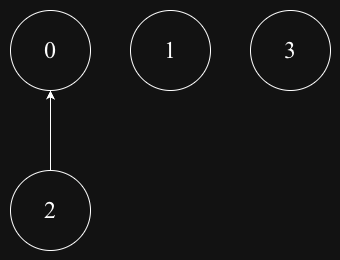
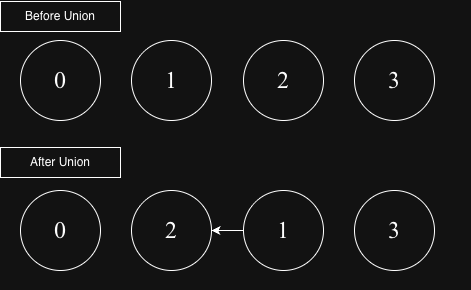

## Disjoint Set Union

A data structure that efficiently manages groups of elements that are partitioned into disjoint (non-overlapping) sets. It supports two key operations:
- Union: Merge two sets into one
- Find: Determine which set an element belongs to (often by finding the "representative" of the set)

### Find Test-1 Graph

### Find Test-2 Graph

### Union Test Graph

