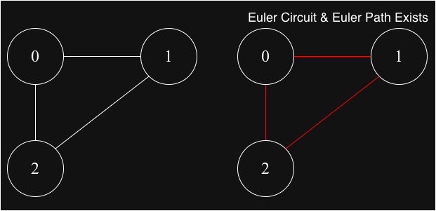
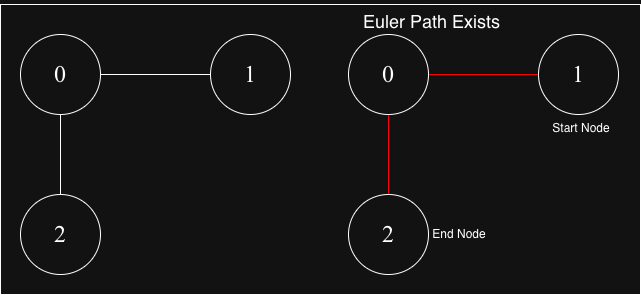
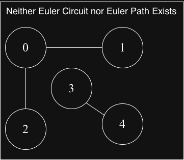

## Euler Path & Euler Circuit

## Euler Path
A path in a graph that visits every `edge exactly once`. Vertices may be repeated.

## Euler Circuit
An Euler path that `starts` and `ends` at the same vertex.

### Euler's Theorems

### For Undirected Graphs:
1. Euler Circuit Existence:
A `connected undirected` graph has an Euler circuit iff:
    a. All vertices have even degree

2. Euler Path Existence:
A `connected undirected` graph has an Euler path (but not circuit) iff:
    a. Exactly 0 or 2 vertices have odd degree 
    b. If 2 vertices have odd degree, they must be the start and end

### For Directed Graphs:
1. Euler Circuit Existence:
A strongly `connected directed` graph has an Euler circuit iff:
    a. Every vertex's indegree = outdegree

2. Euler Path Existence:
A `connected directed` graph has an Euler path iff:
    a. At most one vertex has `(outdegree - indegree) = 1` (start)
    b. At most one vertex has `(indegree - outdegree) = 1` (end)
    c. All other vertices have `indegree = outdegree`
    d. The graph is connected when ignoring edge directions

### Test Diagrams

### Graph-1

### Graph-2

### Graph-3

