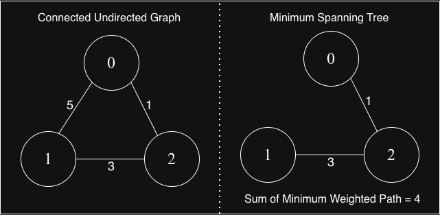
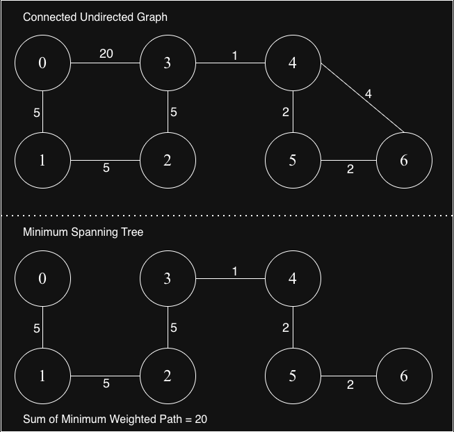

## Minimum Spanning Tree (MST)
A Minimum Spanning Tree is a subset of edges in a connected, undirected, weighted graph that:

1. Connects all vertices together
2. Has no cycles (forms a tree)
3. Minimizes total edge weight

### Key Properties
✅ For: Undirected, weighted, connected graphs

❌ Not for: Directed graphs (use arborescence algorithms)

✅ Always exists if graph is connected

✅ May not be unique if multiple edges have same weights

✅ Number of edges: Always V-1 edges for V vertices

### Why "Spanning"?
Spanning = covers all vertices
Tree = connected, acyclic
Minimum = sum of edge weights is minimized
Think of it as: "Connect all cities with minimum road construction cost"

### Graph-1

### Graph-2

## MST Algorithms

1. [Prim's Algorithm](./prim-s-algorithm/)
2. [Kruskal's Algorithm](./kruskal-s-algorithm/)

## Applications
Real-World Examples:
1. Network Design
  - Connect offices with minimum cable cost
  - Phone line installation
  - Electrical grid design

2. Transportation
  - Road network planning
  - Airline route optimization
  - Shipping logistics

3. Computer Networks
  - Broadcast network design
  - Cluster analysis
  - Image segmentation

4. Approximation Algorithms
  - Traveling salesman problem (TSP)
  - Steiner tree problems
  - Network reliability
