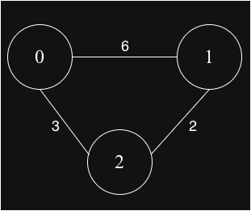
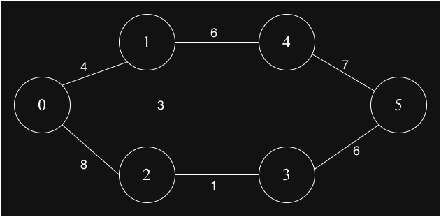
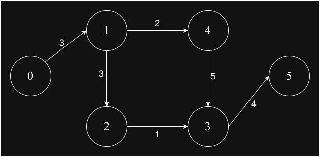
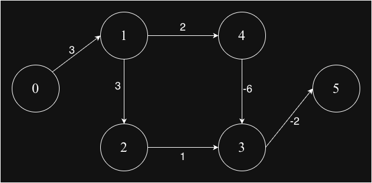

## Shortest Path using Bellman-Ford Algorithm
Bellman-Ford finds the shortest path from a single source to all vertices in a weighted graph that may contain negative edge weights. It can also detect negative weight cycles reachable from the source.

### Key Properties
✅ Works for: All weighted graphs (positive, negative, zero weights)

✅ Special feature: Detects negative cycles reachable from source

✅ Finds: Shortest path from single source to all vertices

✅ Guarantee: Correct if no negative cycles reachable from source

❌ Complexity: Slower than Dijkstra for graphs without negative edges

### Cycle Detection
The algorithm detects negative cycles by performing one extra iteration (the nth iteration) after (n-1) relaxations. If any distance still decreases in this extra iteration, a negative cycle exists and is reachable from the source.

### Graph-1

### Graph-2

### Graph-3

### Graph-4

