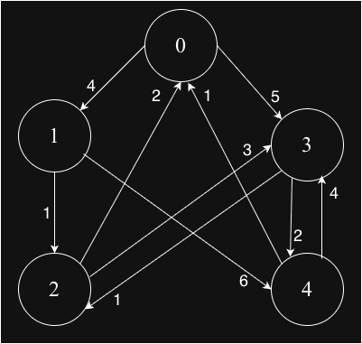

## Shortest Path using Floyd-Warshall Algorithm

Floyd-Warshall finds shortest paths between all pairs of vertices in a weighted graph. It works with positive, negative, and zero weights, and can detect negative cycles.

### Key Properties

✅ Works for: All weighted graphs (positive, negative, zero weights)

✅ Detects: Negative cycles in the entire graph

✅ Finds: Shortest paths between every pair of vertices

✅ Works with: Directed and undirected graphs

❌ Complexity: O(V³) - only suitable for moderately sized graphs

✅ Simple implementation: Just 3 nested loops

### How to detect negative cycle?
Check all weight of all diagonal nodes are less than zero or not, if less than zero then negative cycle exists otherwise don't. 
#### Why diagonal nodes?
The minimal distance to reach node itself it always zero

### Graph-1

