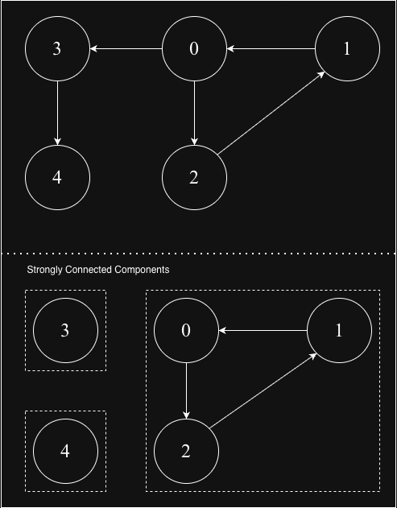
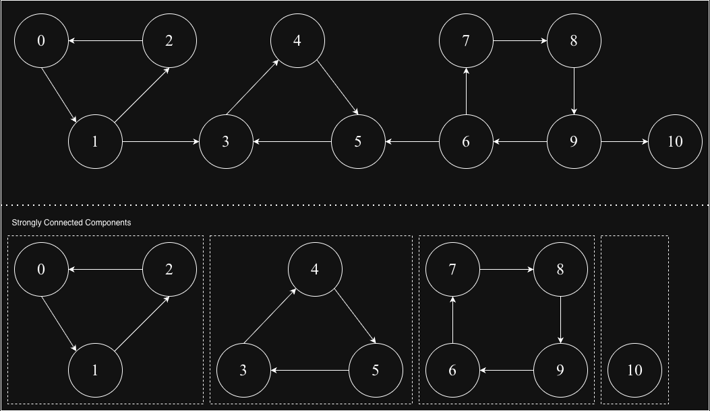

## Strongly Connected Components (SCC)

1. Kosaraju's Algorithm:
Kosaraju's algorithm finds all Strongly Connected Components (SCCs) in a directed graph. An SCC is a maximal subgraph where every vertex is reachable from every other vertex in that subgraph.

### Key Properties:
✅ For: Directed graphs (weighted/unweighted)

✅ Time Complexity: O(V + E) (linear time)

✅ Space Complexity: O(V + E)

✅ Two-pass algorithm: Requires two DFS traversals

✅ Elegant & Simple: Based on clever graph reversal and ordering

✅ Applications: Cycle detection, compiler optimizations, social networks

### Graph-1

### Graph-2

