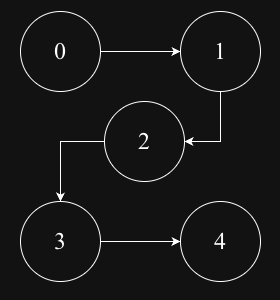
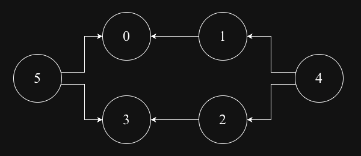

## Topological Sort 
A Topological sort produces a linear ordering of vertices in a directed acyclic graph (DAG) where for every directed edge from vertex u to vertex v, vertex u comes before v in the ordering.
For a given graph there might be multiple topological orders.

### Topological sort by DFS
Lineraly orders vertices in a DAG by performing DFS and pushing vertices onto a stack after exploring all their neighbors, ensuring dependecies are met

### Topological sort by BFS
Topological sort by BFS AKA Kahn's Algorithm, which uses the concept of node in-degrees(number of incoming edges) to determine the processing order. The algorithm ensures that a node is only processed after all its dependecies have been met

### DAG-1

### DAG-2

