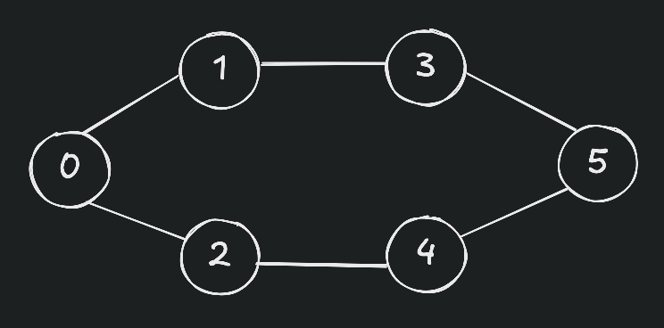

## Traversal of a graph

### Graph

### Depth-First-Search
1. Visit a node
2. Mark it as visited
3. Recursively visit all its unvisited neighbors
4. When reaches a dead end (no unvisited neighbors), backtrack to the previous node

### Breadth-First-Search
1. Visit a source or a root by adding into queue
2. One-by-one visit all its unvisited neighbors
3. If queue becomes empty then stop
